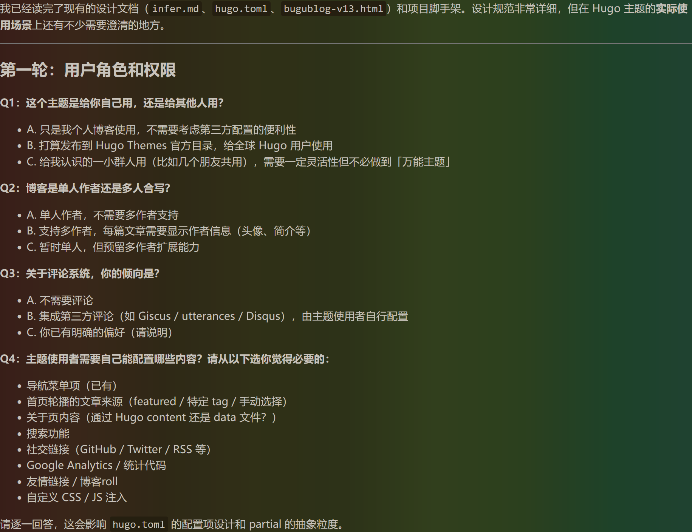
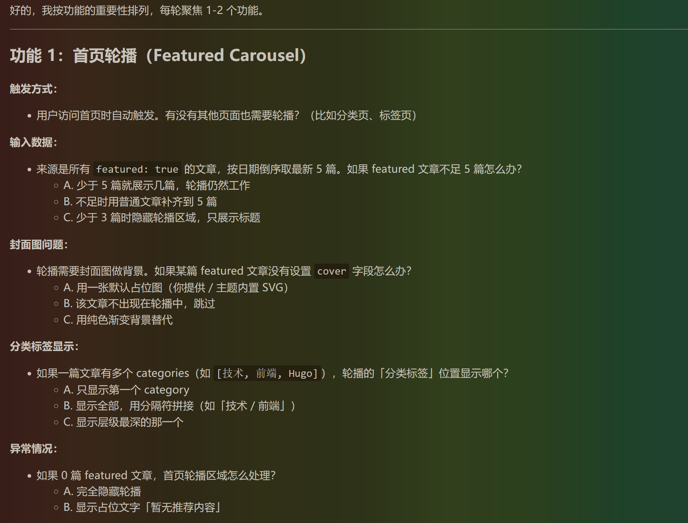

+++
title = 'VibeCoding手记'
date = '2026-05-26T22:17:01+08:00'
draft = false
description = '把虚无缥缈的氛围，变成触手可及的产物。'
featured = true
tags = ['AI', '开发']
cover = 'cover.png'
+++

## 前言

从去年 Claude Code 发布开始，Vibe Coding 的发展速度就令我震惊，让刚工作的我感受到了大大的危机，毕竟 AI 写的代码质量越来越高，效率也越来越快了。但是 AI 现阶段毕竟还只是工具，与其跟工具比力气，不如直接上手用。之前我在使用中都只是让它做一个具体的功能，在现有的框架下修修改改；而最近，我开始尝试让 AI 从零开始做一个项目，本篇文章就是我最近所做的一个总结。

本篇文章的思路实际上是对[LinuxDo](https://linux.do/) 上一位贴主分享的一次实践，在这里也对这位贴主表示非常感谢！

## 使用工具与模型


*注：这次实践中Claude Code中没有使用任何SKILL。*

## Phase 1：需求定义

在进行一个完整项目的开发前，需要确定这个项目究竟要做什么、要实现什么效果。**这一点在后续的 AI 开发中显得尤为重要**，因为 AI 的上下文是有限的。我使用的 DeepSeek V4 Pro 拥有 1M 的上下文，在国产模型中已经是最大的了，但在实际开发中还是捉襟见肘。而需求文档则可以在 AI 忘记之前的内容时，**提醒它**我们项目的开发方向，不至于让它“胡思乱想”。当然，**需求文档自然也是**交给 AI 来生成啦。

### Step 1.1：需求探索对话

**第一轮 —— 项目概述**

AI擅长的就是对话，所以我们就在与AI的话疗中确定需求。用以下提示词开始多轮对话，逐步细化需求：

```markdown
我要开发一个 [项目类型，如：Hugo博客主题]。

请反复问我问题，直到你完全理解我的需求。不要猜测，直接问。

我的初步想法：
- 目标用户：[描述目标用户]
- 核心问题：[这个产品解决什么问题]
- 关键功能：[列出你最想要的 3-5 个核心功能]

请从以下维度逐一问我问题：
1. 用户角色和权限
2. 核心业务流程
3. 数据模型
4. 界面交互
5. 非功能性需求（性能、安全等）

每轮只问 3-5 个最关键的问题，等我回答后再继续。
```

在第一步中我们只需要提出最关键的需求即可，剩下的交给AI来做。下面的图是AI的根据提示给出的问题，而你只需要跟着回答就行了。



我的回答是这样的，只需要进行若干轮次的问答，AI就可以确定你的大致需求了，值得一提的是在问答的过程他提出的问题很多都是我没有思考过的。 我还是太菜了

```markdown
Q1:自己用 Q2:单人作者 Q3:集成Disqus Q4:导航栏菜单、搜索、关于页通过Hugo content、首页轮播内容手动选择、社交链接、GOOGLE Aanlytics、友情链接
```

**第二轮 —— 细化核心功能**

在得到大致的需求后，我们可以进行第二轮问答来细化核心功能。我们向AI做出如下指示：

```markdown
现在针对核心功能进行细化。请逐一问我关于以下每个功能的具体细节：

[功能1名称]：
- 用户如何触发这个功能？
- 输入什么数据？
- 预期输出什么？
- 有哪些异常情况需要处理？
- 有没有权限限制？
```

让我们来看一下AI的回复以及我的回答



```markdown
功能一： 只有首页触发轮播图，自动触发 输入数据：A 分类标签显示：最多展示三个（按顺序），每个标签都使用一个tag容器 异常状况：隐藏轮播图
```

很好，可以看出AI提出了更加具体的功能需求，只需要继续这样的对话，整个项目需求文档基本就确定了。

**第三轮 —— 边界条件和约束**

这是最后一步了，完成这一步之后即可定稿需求文档了。让我们问AI：

```markdown
请帮我梳理边界条件和约束：

1. 哪些操作需要确认/撤销？
2. 数据量级预估（用户数、数据条数）？
3. 哪些场景需要 loading 状态？
4. 哪些场景需要错误提示？
5. 有没有特殊的合规/安全要求？
6. 移动端是否需要适配？
7. 是否需要国际化？
8. 是否需要暗色模式？
```

回答完这一轮后，告诉AI生成需求文档：

```markdown
基于我们以上的讨论，请生成一份完整的需求文档，保存为 docs/requirements.md。

文档结构要求：

# [项目名称] 需求文档

## 1. 项目概述
- 项目背景
- 目标用户
- 核心价值

## 2. 功能需求
### 2.1 [功能模块1]
- 功能描述
- 用户操作流程
- 输入/输出
- 异常处理
- 优先级（P0/P1/P2）

### 2.2 [功能模块2]
...

## 3. 非功能需求
- 性能要求
- 安全要求
- 兼容性要求
- 可用性要求

## 4. 用户角色与权限
## 5. 数据实体关系（初步）
## 6. UI/UX 概要
## 7. 里程碑与优先级

请写入 docs/requirements.md 文件。
```

很好，讨论到这里我还没有遇到AI忘掉之前讨论的情况，也没有触发CLAUDE CODE自动压缩上下文的情况，所以AI的记忆力是足以支持起一个完整项目的需求讨论环节的。最后，让我们再检查一下需求文档吧。

```markdown
请逐条确认以上需求文档中是否有：
1. 描述模糊或歧义的地方
2. 功能之间的逻辑冲突
3. 遗漏的关键场景

如有，请直接修改 docs/requirements.md。
确认无误后，告诉我「需求文档已定稿」。
```

## 未完待续





项目重写三遍，我已经掌握了ai编程大型项目的秘籍！！！





封面图：静谧时光




